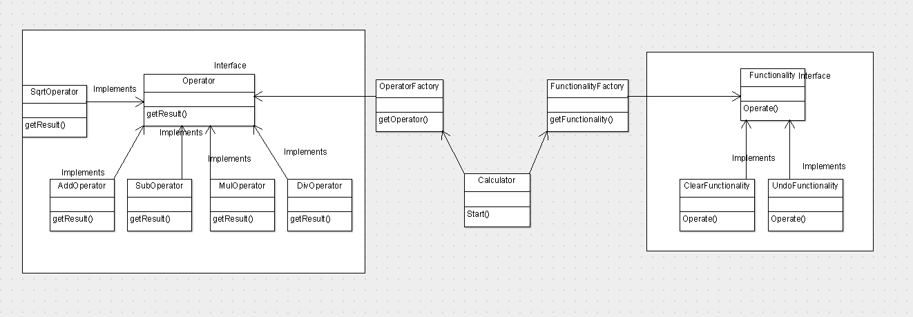

# Airwallex

本项目主要采用采用了工厂模式，对运算符和功能编写接口，同时实现相应的实现类，在以后的拓展中，只需要实现相应的类并且在工厂和计算器类中添加判断语句即可，不用大范围修改计算器类，降低代码耦合。计算器类位于Calculator包下，运算符和功能相关的源文件在Operator包下，在源代码中也添加了相应的注释，下面是项目的类图：
 
 

Operator包中也包含一个OperatorTest，用于单元测试，测试了OperatorFactory和Operator相应实现类中的方法，项目使用Eclipse编写，使用Junit进行单元测试。

